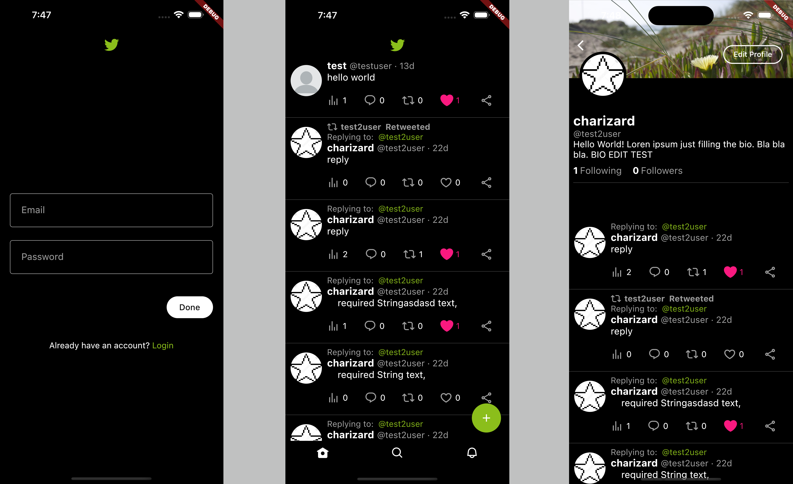

# TwitterLime - Twitter Clone

This is a Twitter clone built with Flutter, Firebase, and Riverpod. It provides a platform for users to post tweets, follow other users, like and retweet tweets, and receive notifications. Basicly this project replicates the core functionality and user experience of Twitter.

## Features

- User registration and authentication
- Post tweets with text and images
- Follow and unfollow other users
- Like and retweet tweets
- Reply to tweets
- Notifications for likes, retweets, and mentions
- Explore hashtags
- Search users

## Screenshots

## Getting Started

### Prerequisites

- Flutter SDK: [Installation Guide](https://flutter.dev/docs/get-started/install)
- Firebase Project: Create a new project on the [Firebase Console](https://console.firebase.google.com/) and set up the necessary authentication and Firestore database.

### Installation

1. Clone the repository:
   [Twitter Clone](https://github.com/Charizard17/twitter_clone)

2. Change to the project directory:
   cd twitter-clone

3. Install dependencies:
   flutter pub get

4. Configure Firebase:

- Add your Firebase configuration file (`google-services.json` for Android or `GoogleService-Info.plist` for iOS) to the project's `android/app` and `ios/Runner` directories respectively.
- Update the Firebase configuration in the `lib/config/firebase_config.dart` file.

5. Run the app:
   flutter run
